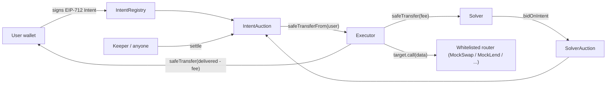

# IntentAuction

[](https://intent-auction.vercel.app/) [](https://sepolia.etherscan.io/address/0x1fD91229ee0217E9381d936Dc43d6E81283eD5c4) [](LICENSE)

**Onchain competitive intent solver marketplace, on Ethereum.**

Users sign gasless EIP-712 intents (*"swap 1 mWETH for at least 1,990 mUSDC, and pay whichever solver does it best a fee up to 5 mUSDC"*). Solvers race in a short onchain auction to win the intent by offering the highest **net value to the user** (`outputAmountOffered - solverFee`). Anyone can settle the winning bid after the auction closes; settlement is atomic and griefing-proof.

> Think of it as a minimal, transparent, onchain version of the solver network that powers CoW Protocol / 1inch Fusion — written from scratch to demonstrate deep understanding of intents, EIP-712, and atomic multi-call execution.

---

## Try it live (Sepolia)

- **Live frontend:** **[intent-auction.vercel.app](https://intent-auction.vercel.app/)** — connect a Sepolia-funded wallet and test either side of the auction.
- **Contract:** [`IntentAuction`](https://sepolia.etherscan.io/address/0x1fD91229ee0217E9381d936Dc43d6E81283eD5c4) (see [the full trace of a live settlement](#live-demo-trace-sepolia) below).
- **No tokens needed** — the UI has a built-in faucet that mints mock WETH / USDC. You only need Sepolia ETH for gas ([Alchemy faucet](https://www.alchemy.com/faucets/ethereum-sepolia)).
- **Play both sides.** Post an intent as a user, then bid on it as a solver. Cross-wallet testing tip: set `auctionDuration` to a larger block count on `/create` (e.g. `60` ≈ 12 min) so you have time to switch wallets before the window closes.

---

## Contents

- [Why this project is interesting](#why-this-project-is-interesting)
- [Architecture](#architecture)
- [Security notes](#security-notes)
- [Skills demonstrated](#skills-demonstrated)
- [Getting started](#getting-started)
- [Testing](#testing)
- [Deployment (Sepolia)](#deployment-sepolia)
- [Live demo trace (Sepolia)](#live-demo-trace-sepolia)
- [Running the frontend](#running-the-frontend)
- [Fork and deploy your own](#fork-and-deploy-your-own)
- [Live Sepolia addresses](#live-sepolia-addresses)
- [Directory layout](#directory-layout)
- [License](#license)

---

## Why this project is interesting

- **Intent pattern**, end-to-end: users declare outcomes, not instructions. A single signed message drives an onchain auction that sources liquidity competitively.
- **Griefing-proof settlement**: the Executor verifies `balanceOf(tokenOut)` deltas instead of trusting return data. A solver who commits to 2,000 USDC but delivers 1,500 gets reverted, with the user keeping every wei of `tokenIn`.
- **Tight safety model**: reentrancy guards, checks-effects-interactions on every state-changing path, admin-gated target whitelist, strict-improvement bids, EIP-1271 smart-wallet signatures.
- **Real testing discipline**: 36 unit + fuzz + invariant tests (1,000 fuzz runs each by default; ramps to 10,000+ in CI), handler-driven invariants, custom errors for cheap asserts.
- **Shipped, not just written**: Foundry deploy + verify script, sync'd ABIs, Next.js 14 + wagmi v2 + RainbowKit frontend with the four-state Connect → Switch → Approve → Execute flow.

---

## Architecture




The stack is three abstract contracts (`IntentRegistry` → `SolverAuction` → `IntentAuction`) plus an isolated `Executor` that runs solver calldata in a locked-down environment. See in-source NatSpec for detail.


| Contract         | Role                                                                                         |
| ---------------- | -------------------------------------------------------------------------------------------- |
| `IntentRegistry` | EIP-712 domain + struct hashing, signature verify (ECDSA + ERC-1271), nonce/deadline checks. |
| `SolverAuction`  | Whitelisted targets, strict net-value bid improvement, block-based auction window.           |
| `IntentAuction`  | Orchestrator. CEI settlement, user → Executor fund push, fee split.                          |
| `Executor`       | Stateless, auction-only multi-call runner. Balance-delta slippage / griefing check.          |
| `IntentLib`      | Canonical `INTENT_TYPEHASH` + memory/calldata struct hashing helpers.                        |
| `Mock*`          | Deterministic swap + lending + tokens for fork-free tests and demo.                          |


---

## Security notes

Concrete attacker models that were considered, and how each is mitigated. The full fuzz + invariant suite asserts the key ones.


| Attack                                           | Mitigation                                                                                                                                            |
| ------------------------------------------------ | ----------------------------------------------------------------------------------------------------------------------------------------------------- |
| Signature replay across intents / chains         | EIP-712 domain separator binds chain id + contract; per-user monotonic `nonce` burned at `postIntent`; `deadline` enforced.                           |
| Solver lies about `outputAmountOffered`          | `Executor` measures `balanceOf(tokenOut)` before/after the call and reverts if the delta is below the user's `minAmountOut`.                          |
| Malicious target drains `Executor` or user funds | Targets are admin-gated via `TargetAllowed` whitelist. `Executor` is stateless, holds funds only for the duration of a single call, resets approvals. |
| Griefing via bogus bids that block better ones   | Bids must strictly improve net value (`outputOffered − solverFee`); no deposit required, no bid ever blocks a higher one.                             |
| Reentrancy on settle (malicious token / router)  | `nonReentrant` on external entry points, CEI ordering (status flipped to `Settled` before any transfer), SafeERC20.                                   |
| Early / late settlement                          | `settle` reverts before `auctionEndBlock`; post-settlement cancel / re-bid is explicitly rejected via status checks.                                  |
| Smart-wallet users excluded                      | `IntentRegistry` accepts ERC-1271 signatures alongside ECDSA.                                                                                         |


Not a production protocol — no audit, mock DeFi integrations, admin-controlled target list, and `Ownable` rather than a timelock'd multisig. The goal is to demonstrate the mechanism cleanly, not to hold mainnet liquidity.

---

## Skills demonstrated

- EIP-712 typed-data design and signature verification (EOA + smart wallet).
- Intent-based protocol design with atomic multi-call execution.
- Onchain sealed-bid-like auction mechanics with griefing resistance.
- Reentrancy protection, Checks-Effects-Interactions discipline, custom errors.
- Gas-aware storage packing (`uint96` auction end block next to `uint8` status).
- Foundry: unit tests, fuzz tests (≥1,000 runs), handler-driven invariant tests, gas snapshots, coverage, deploy/verify scripting.
- SafeERC20 / `forceApprove` for non-standard tokens (USDT-style).
- Modern frontend: Next.js 14 App Router, wagmi v2, viem, RainbowKit, Tailwind, EIP-712 signing via `signTypedData`, event-sourced feed via `getLogs`.

---

## Getting started

### 1. Prerequisites

- [Foundry](https://book.getfoundry.sh/getting-started/installation) (`forge --version`)
- Node.js ≥ 20 (for the frontend; `node --version`)
- A Sepolia RPC URL (Alchemy / Infura / …) and a funded testnet private key
- An Etherscan API key for verification

### 2. Clone and install

```bash
git clone https://github.com/<your-handle>/intent-auction.git
cd intent-auction

# Solidity deps (forge-std + OpenZeppelin v5)
forge install

# Frontend deps
cd frontend && npm install && cd ..
```

### 3. Environment

The project has **two** env files — one for Foundry at the repo root, and one
for Next.js inside `frontend/` (Next only reads env from its own directory).

```bash
# Contracts (RPC, deployer key, Etherscan key)
cp .env.example .env

# Frontend (Alchemy + WalletConnect keys, NEXT_PUBLIC_*_ADDRESS vars)
cp frontend/.env.local.example frontend/.env.local
```

After running the deploy script, copy the addresses from
`deployments/sepolia.json` into `frontend/.env.local`.

---

## Testing

```bash
# Full suite
forge test -vvv

# Heavier fuzzing (recommended before any change to auction math)
forge test --fuzz-runs 10000

# Handler-driven invariants only
forge test --match-contract IntentAuctionInvariantTest

# Gas snapshot (saves to .gas-snapshot)
forge snapshot

# Coverage report (HTML under coverage/)
forge coverage --report lcov && genhtml lcov.info --output coverage
```

Current status: **36 tests, 0 failing, 0 skipped.** Fuzz tests run at 1,000 cases per invocation locally. Invariant tests run 64 sequences of 32 random actions across a three-user handler.

### Frontend smoke tests (Playwright)

A minimal Playwright suite boots `next dev` and asserts the public pages
render without runtime errors. It does *not* connect a wallet — the goal
is just to catch a bad deploy before a human sees it.

```bash
cd frontend
npx playwright install chromium   # one-time
npm run test:e2e                  # headless
npm run test:e2e:headed           # watch it click through
```

Tests live in `frontend/tests/e2e/smoke.spec.ts`.

---

## Deployment (Sepolia)

```bash
forge script script/Deploy.s.sol:Deploy \
  --rpc-url $SEPOLIA_RPC_URL \
  --private-key $PRIVATE_KEY \
  --broadcast \
  --verify --etherscan-api-key $ETHERSCAN_API_KEY \
  -vvvv
```

Addresses are written to `deployments/sepolia.json`. Paste them into `frontend/.env.local` as the `NEXT_PUBLIC_*_ADDRESS` vars (template at `frontend/.env.local.example`).

Then run the end-to-end demo.

**Local anvil** (auto-rolls blocks inside the script):

```bash
forge script script/Demo.s.sol:Demo --rpc-url http://localhost:8545 \
  --private-key $PRIVATE_KEY --broadcast
```

**Live Sepolia** — split into two stages because the 12-block auction window can't elapse inside a single simulated block:

```bash
# Stage 1: post + bid
forge script script/Demo.s.sol:Demo --sig "postAndBid()" \
  --rpc-url $SEPOLIA_RPC_URL --private-key $PRIVATE_KEY --broadcast --slow

# Wait ~12 Sepolia blocks (~2.5 min), then:

# Stage 2: settle
forge script script/Demo.s.sol:Demo --sig "settleOnly()" \
  --rpc-url $SEPOLIA_RPC_URL --private-key $PRIVATE_KEY --broadcast --slow
```

### Live demo trace (Sepolia)


| Step                             | Tx                                                                                                                  |
| -------------------------------- | ------------------------------------------------------------------------------------------------------------------- |
| 1. `MockERC20.mint` (0.01 mWETH) | `[0xd818674a…](https://sepolia.etherscan.io/tx/0xd818674a63e91db9dc8d985602845286cde7a2f3a27f328641c4cf9c7c5b2b45)` |
| 2. `MockERC20.approve` auction   | `[0xa97e8481…](https://sepolia.etherscan.io/tx/0xa97e84814b59641fa367c8c244f579a55fe5a87755a415a8e0d7676b98d3aefa)` |
| 3. `IntentAuction.postIntent`    | `[0xe9eda0d3…](https://sepolia.etherscan.io/tx/0xe9eda0d3540ab017beca84d52ca240dddf9c5e0e9c2e672ae8f1c01d5af332ee)` |
| 4. `IntentAuction.bidOnIntent`   | `[0xbdc28f35…](https://sepolia.etherscan.io/tx/0xbdc28f359bb25582b05c31fbc445beb1e048ecdb98c274efb37fc3807d8b7cc5)` |
| 5. `IntentAuction.settle`        | `[0xe9338549…](https://sepolia.etherscan.io/tx/0xe9338549eb78de031ec2c7b730c5fd913f6cc98bfa120dd73397e20f76f2d715)` |


The `settle` transaction atomically:

1. Pulled **0.01 mWETH** from the user into `Executor`.
2. Called `MockSwapRouter.swap(mWETH → mUSDC, 0.01e18)` — returned **20 mUSDC**.
3. Verified `delivered ≥ minAmountOut` via balance-delta check.
4. Paid **19.5 mUSDC** to the user and **0.5 mUSDC** to the solver.

Intent id: `0x702afd595cf84bbae80993f49acd56d8c46155503ba6f66b9e1f1bc46bb1fd2f`.

---

## Running the frontend

```bash
cd frontend
npm run sync-abis       # copies ABIs from out/* into lib/abis.generated.ts
npm run dev             # http://localhost:3000
```

Pages:

- `/` — live feed of all posted intents, a "How it works" walk-through, a mock-token faucet, and a recent-settlements row (all from `getLogs`).
- `/create` — signed-intent form; signs EIP-712 with `signTypedData`, then posts onchain.
- `/intent/[id]` — per-intent page: current best bid, solver bid form, settle button. Uses the four-state button pattern (Connect → Switch → Approve → Execute).

To point the frontend at the already-deployed Sepolia contracts, copy the addresses from the [Live Sepolia addresses](#live-sepolia-addresses) table into `frontend/.env.local` and set `NEXT_PUBLIC_DEPLOY_BLOCK=10706010`.

---

## Fork and deploy your own

Ship your own deployment in ~5 minutes:

```bash
# 1. Fork + clone
git clone https://github.com/<you>/intent-auction.git && cd intent-auction
forge install
cd frontend && npm install && cd ..

# 2. Fill in env
cp .env.example .env                       # SEPOLIA_RPC_URL, PRIVATE_KEY, ETHERSCAN_API_KEY
cp frontend/.env.local.example frontend/.env.local   # NEXT_PUBLIC_ALCHEMY_API_KEY, NEXT_PUBLIC_WALLETCONNECT_PROJECT_ID

# 3. Test
forge test

# 4. Deploy + verify
set -a && source .env && set +a
forge script script/Deploy.s.sol:Deploy \
  --rpc-url $SEPOLIA_RPC_URL --broadcast \
  --verify --etherscan-api-key $ETHERSCAN_API_KEY -vvvv

# 5. Wire the frontend to the new addresses, then run it
#    (paste the addresses written to deployments/sepolia.json and the current
#    block number into frontend/.env.local as NEXT_PUBLIC_*_ADDRESS / NEXT_PUBLIC_DEPLOY_BLOCK)
cd frontend
npm run sync-abis
npm run dev
```

Optional extras:

- Set `NEXT_PUBLIC_GITHUB_URL` in `frontend/.env.local` to render a "source" link in the footer.
- Deploy the frontend to Vercel directly from your fork: no custom build step required, just set the same `NEXT_PUBLIC_*` env vars in the Vercel project settings.

---

## Live Sepolia addresses

All contracts are verified on [Sepolia Etherscan](https://sepolia.etherscan.io) (deployed at block **10,706,010**).


| Contract          | Address                                                                                                                         |
| ----------------- | ------------------------------------------------------------------------------------------------------------------------------- |
| `IntentAuction`   | `[0x1fD91229ee0217E9381d936Dc43d6E81283eD5c4](https://sepolia.etherscan.io/address/0x1fD91229ee0217E9381d936Dc43d6E81283eD5c4)` |
| `Executor`        | `[0xCbAd72506bFEc87b5e1d575e65142C71051129B0](https://sepolia.etherscan.io/address/0xCbAd72506bFEc87b5e1d575e65142C71051129B0)` |
| `mWETH`           | `[0xA6bE9ABc6C407cfA2a9Ce2F46759e49C45D34cCe](https://sepolia.etherscan.io/address/0xA6bE9ABc6C407cfA2a9Ce2F46759e49C45D34cCe)` |
| `mUSDC`           | `[0x4b0Cb1f10c19a839b4fF5a7d5dF981367eB998E8](https://sepolia.etherscan.io/address/0x4b0Cb1f10c19a839b4fF5a7d5dF981367eB998E8)` |
| `aUSDC`           | `[0x68c9b271d6CbBd679Ed719e4426C1A7A9babea23](https://sepolia.etherscan.io/address/0x68c9b271d6CbBd679Ed719e4426C1A7A9babea23)` |
| `MockSwapRouter`  | `[0x47aC33d3fa3878b3664ac14b9fd8acEb9e17D2a0](https://sepolia.etherscan.io/address/0x47aC33d3fa3878b3664ac14b9fd8acEb9e17D2a0)` |
| `MockLendingPool` | `[0x0E03C3333C25D61C1075b64D07E220c7bb403d96](https://sepolia.etherscan.io/address/0x0E03C3333C25D61C1075b64D07E220c7bb403d96)` |


---

## Directory layout

```
intent-auction/
  foundry.toml, remappings.txt, .env.example
  src/
    interfaces/IIntentAuction.sol, IExecutor.sol
    libraries/IntentLib.sol
    IntentRegistry.sol, SolverAuction.sol, IntentAuction.sol
    Executor.sol
    mocks/MockERC20.sol, MockSwapRouter.sol, MockLendingPool.sol
  script/Deploy.s.sol, Demo.s.sol
  test/
    IntentRegistry.t.sol, SolverAuction.t.sol, IntentAuction.t.sol
    IntentAuction.fuzz.t.sol, IntentAuction.invariant.t.sol
    utils/SigUtils.sol, Handler.sol
  frontend/                # Next.js 14 + wagmi + RainbowKit
    app/, components/, lib/, scripts/sync-abis.ts
    tests/e2e/smoke.spec.ts, playwright.config.ts
  deployments/sepolia.json # written by Deploy.s.sol
```

---

## License

MIT. See `LICENSE`.